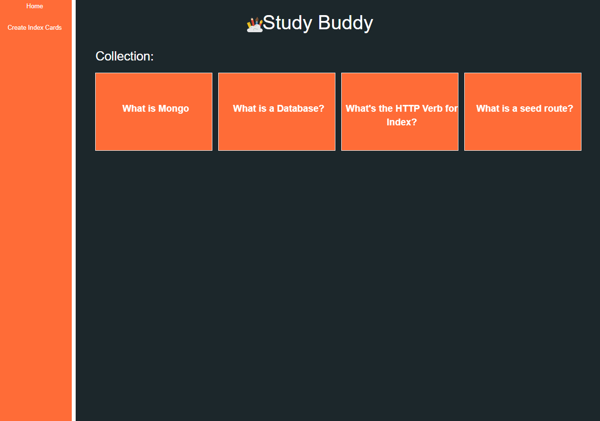

# Study Buddy 

A simple web app for creating helpful study materials. 
## Technologies

- HTML5
- CSS
- Node.js
- Express.js
- Heroku
- MongoDB
- Mongoose

## Screenshots

### Website
 

## Getting Started

[click here](https://gs-studybuddy.herokuapp.com) to see working app

## Future Enhancements

- Offer user login
- Enable upload of images 
- Embeded videos
- Multiple soruces 
- Folders for different subjects
